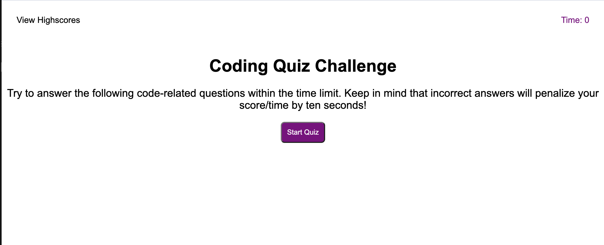

# Coding-Quiz-Game

## Description

This application is a coding quiz game that displays a question with answers to choose from while being timed. This allowed good practice with HTML and CSS since there was no starter code. The main focus here was practicing javascript by creating functions to display a timer, numerous buttons, and working on local storage to keep track of the scores. It was especially important to keep track of variables in order to ensure your application runs correctly.

## Installation

N/A

## Usage

The opening page will have a title of "Coding Quiz Challenge" with a prompt that briefling explains the directions. There are 5 questions and the user must answer them within 60 seconds.The timer will start and the first question will appear once the user clicks on the "Start Quiz" button. For each question that is wrong, 10 seconds will be deducted from the timer. Once all the questions are answered and/or the timer runs out, the user will be able to enter their initials to keep track of their highscores. The user can then either go back to the start of the quiz game or they can clear their highscores if they wish.

Link of Deployment: 

## Credits

To create the question layout style to have each question pop up after being answered was referenced off of https://github.com/cynthiamory/javascript-test.git

## License

Please refer to LICENSE in the repository
